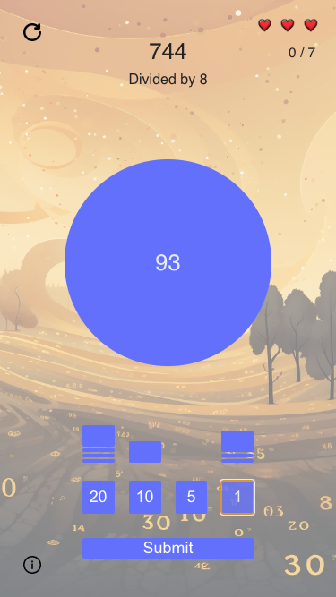

# Division Game

Division Game is an interactive game where players are tested on their ability to divide numbers. Written in TypeScript and using ViteJS for development and bundling.



## Objective

You're presented with two numbers:

1. A larger number at the top.
2. A smaller number at the bottom prepended with the phrase "Divided by".

Your task is to divide the large number by the smaller number. The smaller number will always divide into the larger number evenly. 

**Rules**:
- Players have 3 lives. Losing all lives requires a restart.
- Submit an incorrect answer and lose a life.
- Win by correctly answering 7 times in a row.

## How to Play

There are 4 buttons with the numbers "20", "10", "5", and "1". Click on these buttons to set your answer. You can use a combination of these inputs, even using a button more than once. Your inputs will be summed up to provide the answer.

## Features

- Refresh the game anytime.
- Dynamic visuals sourced from **midjourney**. All game prompts are constructed by the author.
- Engaging UI/UX for optimal gameplay experience.

## Future Plans

- Introduce a leaderboard, recording and showcasing top players worldwide.
- Implement logic to gauge if the player's chosen inputs are the most efficient way to get to the answer.

## Setup and Installation

1. Clone the repository:
```bash
git clone https://github.com/barrymun/division-game.git
```

2. Change into the directory:
```bash
cd division-game
```

3. Install the dependencies:
```bash
yarn install
```

4. Start the development server:
```bash
yarn dev
```

Now, the game should be running on `http://localhost:5173`.

## Credits

- Images, including background visuals, are sourced from [midjourney](https://www.midjourney.com/).
- Game prompts and design by the author.
- Inspired by the exercises on [Elevate](https://elevateapp.com/).
- A heartfelt thank you to [VanJS](https://vanjs.org/) for their work.

## License

This project is licensed under the MIT License.

---

Enjoy the game and keep practicing your division skills! 🎮🧠
